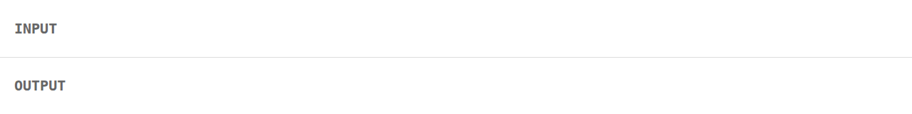

<div align="center">
  
  <br />
  <a href="https://www.npmjs.com/package/nozzle-js"></a>
  <a href="https://github.com/robert-cunningham/nozzle/blob/main/LICENSE"></a>
  <a href="https://bundlephobia.com/result?p=nozzle-js"></a>
  <br />
  <br />
  <a href="#Quickstart">Quickstart</a>
  <span>&nbsp;&nbsp;•&nbsp;&nbsp;</span>
  <a href="#Reference">Reference</a>
  <br />
  <hr />
</div>

<!-- [![npm version][npm-src]][npm-href]
[![Bundle size][bundlephobia-src]][bundlephobia-href]
[![License][license-src]][license-href]
-->

Nozzle is a utility library for manipulating streams of text, and in particular streamed responses from LLMs.

## Installation

```bash
npm i nozzle-js # or pnpm / bun / yarn
```

nozzle is written in TypeScript and has both cjs and esm builds.

## Usage

```ts
// Parse image references into structured objects
const stream = await openai.chat.completions.create({ ...args, stream: true })

return nz(stream).parse(/img-(\w+)/g, (match) => ({ type: "image", id: match[1] }))
// yields: "Here is ", { type: "image", id: "abc123" }, " for you"
```



```ts
// Use tee to split the stream: one for display, one for storage
const [displayStream, storageStream] = nz(stream).tee(2)

// Stream to user in real-time
const displayPromise = (async () => {
  for await (const chunk of displayStream) process.stdout.write(chunk)
})()

// Capture full response for storage while display consumes concurrently
const [, consumed] = await Promise.all([displayPromise, storageStream.consume()])
const content = consumed.string()
conversation.push({ role: "assistant", content })
```

````ts
// Extract TypeScript code between markdown fences and evaluate it
return eval(
  await nz(stream)
    .after(/```ts\s*/g)
    .before(/\s*```/g)
    .tap(websocketSend)
    .accumulate()
    .last(),
)
````

```ts
// Re-time an LLM response for smoother streaming
return nz(stream)
  .split(/[ .;,]/g)
  .compact()
  .minInterval(100)
```

{{reference}}

## Testing

Install the library:

```bash
git clone https://github.com/Robert-Cunningham/nozzle
cd nozzle
npm i
```

Then run the tests:

```bash
npm run test
```

## License

This library is licensed under the MIT license.
