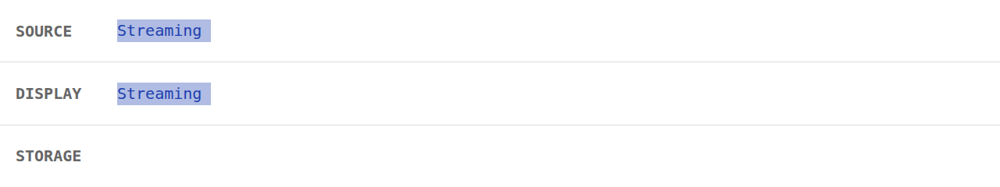
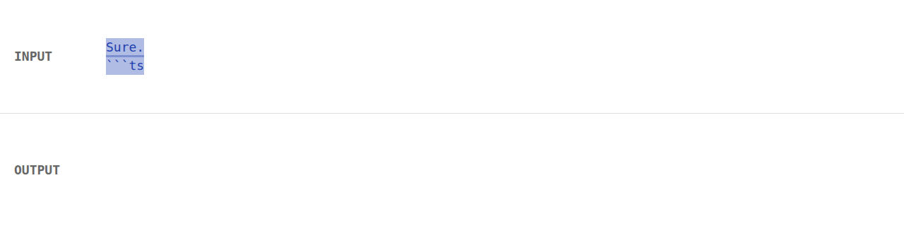
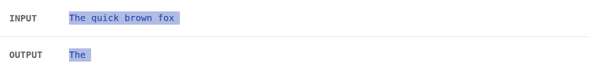

<div align="center">
  
  <br />
  <a href="https://www.npmjs.com/package/nozzle-js"></a>
  <a href="https://github.com/robert-cunningham/nozzle/blob/main/LICENSE"></a>
  <a href="https://bundlephobia.com/result?p=nozzle-js"></a>
  <br />
  <br />
  <a href="#quickstart">Quickstart</a>
  <span>&nbsp;&nbsp;•&nbsp;&nbsp;</span>
  <a href="#recipes">Recipes</a>
  <span>&nbsp;&nbsp;•&nbsp;&nbsp;</span>
  <a href="#reference">Reference</a>
  <br />
  <hr />
</div>

<!-- [![npm version][npm-src]][npm-href]
[![Bundle size][bundlephobia-src]][bundlephobia-href]
[![License][license-src]][license-href]
-->

Nozzle is a small TypeScript library for transforming async iterables, especially streamed text from LLMs.

It helps when provider chunks are not the chunks your app wants: parse structured markers, split text into useful pieces, fan out one stream to multiple consumers, extract generated sections, or smooth token timing without waiting for the whole response.

## Quickstart

```bash
npm i nozzle-js # or pnpm / bun / yarn
```

Nozzle has ESM and CJS builds and works with any sync or async iterable.

<!-- prettier-ignore -->
```ts
import { nz } from "nozzle-js"

const pacedWords = nz(llmTextStream)
  .splitAfter(" ")
  .compact()
  .minInterval(40)

for await (const word of pacedWords) {
  process.stdout.write(word)
}
```

## Recipes

### Parse structured markers as they stream

```ts
const stream = await openai.chat.completions.create({ ...args, stream: true })

const parts = nz(stream)
  .map((chunk) => chunk.choices[0]?.delta?.content ?? "")
  .parse(/img-(\w+)/g, (match) => ({ type: "image", id: match[1] }))

// yields: "Here is ", { type: "image", id: "abc123" }, " for you"
```


### Branch one stream for UI and storage

```ts
const [displayStream, storageStream] = nz(stream).tee(2)

const displayPromise = (async () => {
  for await (const chunk of displayStream) process.stdout.write(chunk)
})()

const [, consumed] = await Promise.all([displayPromise, storageStream.consume()])
conversation.push({ role: "assistant", content: consumed.string() })
```



### Extract a generated section

<!-- prettier-ignore -->
````ts
const code = await nz(stream)
  .after("```ts\n")
  .before("```")
  .tap(sendToPreview)
  .consume()

await saveSnippet(code.string())
````



### Smooth chunky provider output

<!-- prettier-ignore -->
```ts
const smoothStream = nz(stream)
  .splitAfter(" ")
  .compact()
  .minInterval(40)
```



## Reference

{{reference}}

## Testing

Install the library:

```bash
git clone https://github.com/Robert-Cunningham/nozzle
cd nozzle
npm i
```

Then run the tests:

```bash
npm run test
```

## License

This library is licensed under the MIT license.
